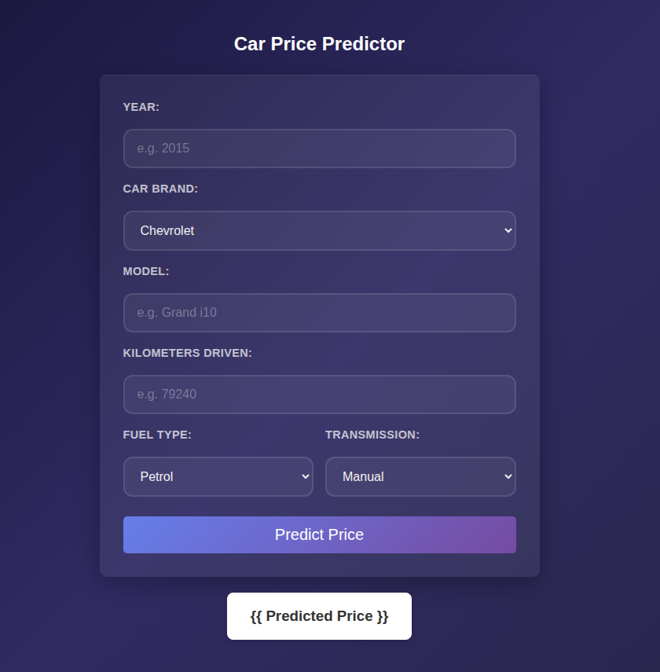

# 🚗 Used Car Price Prediction – End-to-End ML Project

## 📌 Overview

This project is a **complete end-to-end machine learning pipeline** that predicts used car prices. It covers everything from **data scraping to model deployment**, making it a strong, job-ready portfolio project.

The system automates:

* Data collection from the web
* Data cleaning and preprocessing
* Model training using machine learning
* Deployment through a Flask-based web application 

<br>

 `Scrape Data` → `Clean & Transform` → `Train Model` → `Deploy as Web App`

---

## 🧩 Project Workflow

### 1. 📥 Data Scraping

* Scraped used car data using **BeautifulSoup**
* Extracted relevant features such as price, kms driven, fuel type, etc.
* Stored raw data in CSV format

### 2. 🧹 Data Cleaning & Preprocessing

* Cleaned messy real-world data using **Pandas**
* Example1: Converted values like `"53K kms"` → `53000`
* Example2: Converted values like `Petrol` → `0`, &nbsp; &nbsp; `Diesel` → `1`
* Handled missing values and formatting issues
* Saved cleaned dataset as `clean_cars.csv`

### 3. 🤖 Model Training

* Trained a **Random Forest model** on the cleaned dataset
* Performed feature selection and preprocessing
* Saved trained model as `car_price_model.pkl`

### 4. 🌐 Web Application

* Built a web app using **Flask + HTML**
* User inputs car details → model predicts price
* Simple and interactive UI for real-time predictions

---

## 🏗️ Project Structure

```bash
├── 1. scrape
│   ├── cars_data.csv
│   └── scrape.py
│
├── 2. data cleaning
│   ├── clean_cars.csv
│   └── data cleaning.ipynb
│
├── 3.train model
│   └── model training.ipynb
│
├── 4.app
│   ├── app.py
│   ├── car_price_model.pkl
│   └── templates
│       └── index.html
│
└── requiremnets.txt
```

---

## ⚙️ Tech Stack

* **Python**
* **BeautifulSoup** – Web scraping
* **Pandas / NumPy** – Data cleaning & preprocessing
* **Scikit-learn** – Machine learning (Random Forest)
* **Flask** – Backend web framework
* **HTML/CSS** – Frontend

---

## 🔄 How It Works

1. Scrape used car data from websites
2. Clean and preprocess the dataset
3. Train a machine learning model
4. Save the trained model
5. Flask app loads the model
6. User inputs → prediction displayed on UI

---

## 📸 Screenshot


<br>

---

## 📊 Key Highlights

* Real-world data pipeline implementation
* Handles messy scraped data
* End-to-end ML workflow
* Deployable Flask application
* Strong portfolio project for **Data Science / ML roles**

---

## 🚀 Run Locally

### 1. Clone the Repository

```bash
git clone https://github.com/ronakjnrj/Car-Price-Predictor.git
cd Car-Price-Predictor
```

### 2. Install Dependencies

```bash
pip install -r requiremnets.txt
```

### 3. Run the Flask App

```bash
python 4.app/app.py
```

### 4. Open in Browser

```
http://127.0.0.1:5000/
```

---


